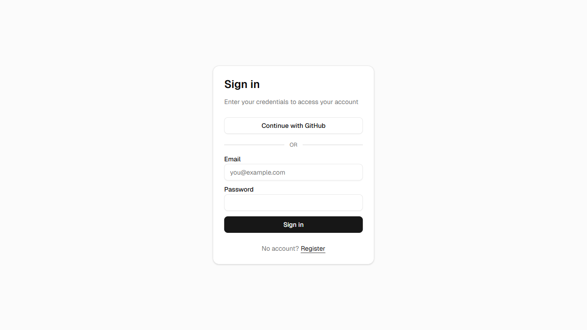

# Invoicify

Invoicing and billing app for Malaysian freelancers. Create clients, issue
numbered invoices with line items and tax, record payments, and track
outstanding balances from a dashboard.

Live demo: https://invoicify-chi.vercel.app



## Features

- Client management with contact details and SSM registration numbers
- Invoices with line items, tax rate, discount, and server-generated
  sequential numbers (`INV-YYYY-NNN`, per user per year, race-condition-safe)
- Invoice statuses: `DRAFT`, `SENT`, `VIEWED`, `PARTIAL`, `PAID`, `OVERDUE`
  (derived on read from due date), `CANCELLED`, `VOID`
- Payment recording (bank transfer, cash, cheque, online, credit card,
  DuitNow, FPX) with immutable payment history; corrections use a
  reversal row rather than deletion
- Server-rendered PDF export per invoice, cached until the invoice is edited
- Dashboard summary of revenue and outstanding amounts
- Auth via NextAuth (credentials + GitHub OAuth)

## Stack

- Next.js 16.1.6 (App Router) + React 19.2.3 + TypeScript 5
- NextAuth v5 (`next-auth@5.0.0-beta.30`) with `@auth/prisma-adapter`
- Prisma 7.4.1 + `@prisma/adapter-neon` + `@neondatabase/serverless`
  (WebSocket pool, required for interactive transactions)
- Neon serverless PostgreSQL
- Tailwind CSS v4 + Radix UI primitives (via `shadcn`)
- `@react-pdf/renderer` v4 for server-side PDF generation
- Zod v4 for request validation
- Vitest for unit tests

## Architecture

```
app/
  (auth)/              login, register (unauthenticated layout)
  (app)/                dashboard, clients, invoices, settings (behind auth)
  api/
    auth/[...nextauth]  NextAuth route handlers
    register             POST create account
    profile               GET/PATCH business profile
    clients/              GET list, POST create
    clients/[id]/          GET, PATCH, DELETE (soft delete)
    invoices/               GET list (adds derived isOverdue), POST create
    invoices/[id]/           GET, PATCH
    invoices/[id]/pdf        GET cached PDF
    invoices/[id]/payments   POST record payment
    dashboard/summary        GET revenue totals
lib/
  db.ts               Prisma client (Neon WebSocket adapter, singleton)
  auth.ts             NextAuth config (JWT session strategy)
  validations.ts      Zod schemas for all API input
  currency.ts         money formatting + totals calculation
  invoice-numbering.ts  atomic per-user invoice number generator
proxy.ts              Edge middleware: redirects unauthenticated requests
prisma/schema.prisma  data model
```

## Data model

All monetary values are stored as **integer minor units** (sen), never
floats. `quantity` on a line item is stored as `units x 100` so fractional
quantities (e.g. 1.5 hours) stay integral; `taxRate` is `percentage x 100`.

- `User`: account + Malaysian business profile (name, SSM reg no, tax ID,
  default tax rate, currency, payment terms) used to prefill new invoices
- `Client`: soft-deleted (`deletedAt`), scoped to the owning `User`
- `Invoice`: belongs to a `User` and a `Client`; snapshots `taxRate` at
  creation time; holds subtotal/tax/discount/total in minor units
- `InvoiceItem`: line items, cascades on invoice delete
- `InvoiceCounter`: `(userId, year)` atomic counter backing invoice numbers
- `Payment`: immutable; a correction is a negative-amount row with
  `reversalOf` pointing at the original payment

## Authorization

Every invoice/client read, write, and delete is scoped with
`findFirst({ where: { id, userId: session.user.id } })` (or the update/delete
equivalent), so a valid session cannot reach another user's records: a
mismatched `id` simply resolves to no row and the route returns 404.
Un-authenticated requests get 401 before any query runs. Invoices that are
`PAID`, `VOID`, or `CANCELLED` reject further edits (422).

## Environment variables

See `.env.example`. Required:

| Variable | Purpose |
|---|---|
| `DATABASE_URL` | Neon Postgres connection string |
| `AUTH_SECRET` | NextAuth session secret (`openssl rand -base64 32`) |
| `NEXTAUTH_URL` | Base URL for NextAuth callbacks |
| `AUTH_GITHUB_ID` / `AUTH_GITHUB_SECRET` | GitHub OAuth app credentials |
| `RESEND_API_KEY` / `RESEND_FROM` | Transactional email delivery |
| `BLOB_READ_WRITE_TOKEN` | Vercel Blob storage for logo/PDF assets |

## Local setup

```bash
npm install               # runs `prisma generate` via postinstall
cp .env.example .env.local
# fill in DATABASE_URL, AUTH_SECRET, and the other variables above

npx prisma db push        # sync schema to your Neon database (dev only)
npm run dev                # http://localhost:3000
```

## Scripts

| Script | Purpose |
|---|---|
| `npm run dev` | start the dev server |
| `npm run build` | production build |
| `npm start` | run the production build |
| `npm test` | run the Vitest suite once |
| `npx tsc --noEmit` | type-check without emitting |
| `npx prisma generate` | regenerate the Prisma client after schema changes |

## Tests

`npm test` runs Vitest against the pure calculation logic
(`lib/currency.ts`, `lib/invoice-numbering.ts`), the Zod validation schemas,
and the per-user authorization scoping on the invoice and client API routes
(mocking `auth()` and the Prisma client to assert the `where` clause is
scoped to the session user and that a foreign id returns 404).

## License

MIT
